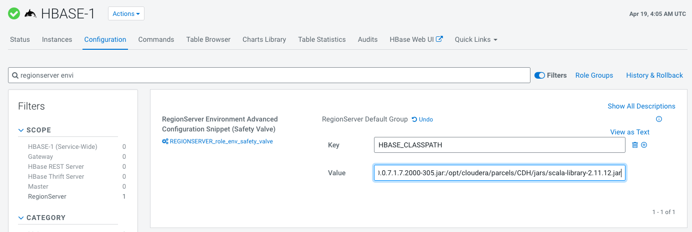
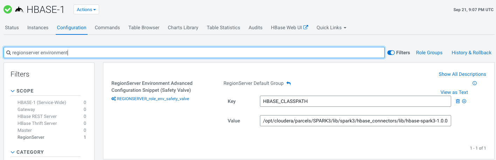
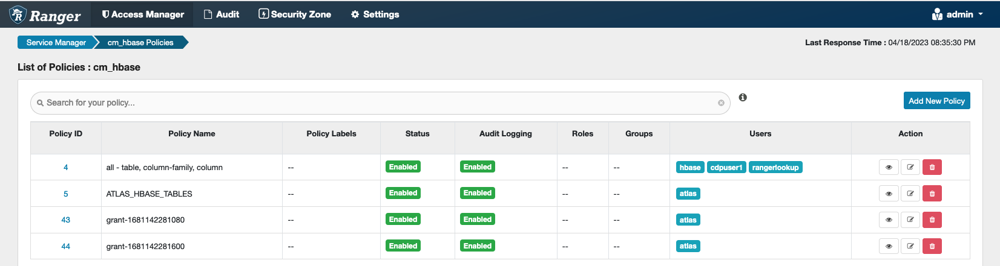

# hbase example

## prerequisite

- change HBase config

[HBase-Spark connector](https://docs.cloudera.com/cdp-private-cloud-base/7.1.8/accessing-hbase/topics/hbase-using-hbase-spark-connector.html)

update hbase config:

```
/opt/cloudera/parcels/CDH/lib/hbase_connectors/lib/hbase-spark-1.0.0.7.1.7.2000-305.jar:/opt/cloudera/parcels/CDH/lib/hbase_connectors/lib/hbase-spark-protocol-shaded-1.0.0.7.1.7.2000-305.jar:/opt/cloudera/parcels/CDH/jars/scala-library-2.11.12.jar
```


restart Hbase service

spark3
Spark3 parcel needs to be distributed across all HBase cluster region server nodes

```
/opt/cloudera/parcels/SPARK3/lib/spark3/hbase_connectors/lib/hbase-spark3-1.0.0.3.3.7180.0-274.jar:/opt/cloudera/parcels/SPARK3/lib/spark3/hbase_connectors/lib/hbase-spark3-protocol-shaded-1.0.0.3.3.7180.0-274.jar:/opt/cloudera/parcels/SPARK3/lib/spark3/jars/scala-library-2.12.15.jar
```

spark3.4
Spark3.4 parcel needs to be distributed across all HBase cluster region server nodes. We need one extra dependency: `scala-parser-combinators`

```
/opt/cloudera/parcels/SPARK3/lib/spark3/hbase_connectors/lib/hbase-spark3-1.0.0.3.3.7180.0-274.jar:/opt/cloudera/parcels/SPARK3/lib/spark3/hbase_connectors/lib/hbase-spark3-protocol-shaded-1.0.0.3.3.7180.0-274.jar:/opt/cloudera/parcels/SPARK3/lib/spark3/jars/scala-library-2.12.15.jar:/opt/cloudera/parcels/SPARK3/lib/spark3/jars/scala-parser-combinators_2.12-1.1.2.jar
```



Spark3 on public cloud

```
${HBASE_CLASSPATH}:/opt/cloudera/parcels/CDH/lib/hbase_connectors/lib/hbase-spark.jar:/opt/cloudera/parcels/CDH/lib/hbase_connectors/lib/hbase-spark-protocol-shaded.jar:/opt/cloudera/parcels/CDH/lib/hbase_connectors/lib/scala-library.jar:/opt/cloudera/parcels/CDH/lib/hbase-cdp-jars/*:/opt/cloudera/parcels/CDH/lib/hbase_connectors_for_spark3/lib/hbase-spark3.jar:/opt/cloudera/parcels/CDH/lib/hbase_connectors_for_spark3/lib/hbase-spark3-protocol-shaded.jar:/opt/cloudera/parcels/CDH/lib/hbase_connectors_for_spark3/lib/scala-library.jar
```

- grant access to user in ranger



- create a table using hbase shell

1. ssh into hbase gateway host
2. start hbase shell

```bash
$ kinit
$ hbase shell
```

```bash
hbase:001:0> create 'person', 'p', 'c'
hbase:002:0> exit
```

- upload source code

```bash
$ scp ./hbase/hbase-write.py cdpuser1@xhu-cm7101-1.xhu-cm7101.root.hwx.site:~/
$ scp ./hbase/hbase-read.py cdpuser1@xhu-cm7101-1.xhu-cm7101.root.hwx.site:~/
```

## run spark jobs

### spark2 examples

- runtime-7.1.7-sp1

```bash
spark-submit --deploy-mode cluster --master yarn --files /etc/hbase/conf/hbase-site.xml --jars /opt/cloudera/parcels/CDH/lib/hbase_connectors/lib/hbase-spark-1.0.0.7.1.7.1000-142.jar,/opt/cloudera/parcels/CDH/lib/hbase_connectors/lib/hbase-spark-protocol-shaded-1.0.0.7.1.7.1000-142.jar,/opt/cloudera/parcels/CDH/jars/scala-library-2.11.12.jar,/opt/cloudera/parcels/CDH/jars/hbase-shaded-client-2.2.3.7.1.7.1000-142.jar,/opt/cloudera/parcels/CDH/jars/hbase-shaded-mapreduce-2.2.3.7.1.7.1000-142.jar,/opt/cloudera/parcels/CDH/jars/opentelemetry-api-0.12.0.jar,/opt/cloudera/parcels/CDH/jars/opentelemetry-context-0.12.0.jar --conf spark.driver.extraClassPath=/app/mount $HOME/hbase-write.py
```

```bash
spark-submit --deploy-mode cluster --master yarn --files /etc/hbase/conf/hbase-site.xml --jars /opt/cloudera/parcels/CDH/lib/hbase_connectors/lib/hbase-spark-1.0.0.7.1.7.1000-142.jar,/opt/cloudera/parcels/CDH/lib/hbase_connectors/lib/hbase-spark-protocol-shaded-1.0.0.7.1.7.1000-142.jar,/opt/cloudera/parcels/CDH/jars/scala-library-2.11.12.jar,/opt/cloudera/parcels/CDH/jars/hbase-shaded-client-2.2.3.7.1.7.1000-142.jar,/opt/cloudera/parcels/CDH/jars/hbase-shaded-mapreduce-2.2.3.7.1.7.1000-142.jar,/opt/cloudera/parcels/CDH/jars/opentelemetry-api-0.12.0.jar,/opt/cloudera/parcels/CDH/jars/opentelemetry-context-0.12.0.jar --conf spark.driver.extraClassPath=/app/mount $HOME/hbase-read.py
```

```bash
spark-submit \
--deploy-mode cluster \
--master yarn \
--files /etc/hbase/conf/hbase-site.xml \
--jars /opt/cloudera/parcels/CDH/lib/hbase_connectors/lib/hbase-spark-1.0.0.7.1.7.1000-142.jar,/opt/cloudera/parcels/CDH/lib/hbase_connectors/lib/hbase-spark-protocol-shaded-1.0.0.7.1.7.1000-142.jar,/opt/cloudera/parcels/CDH/jars/scala-library-2.11.12.jar,/opt/cloudera/parcels/CDH/jars/hbase-shaded-client-2.2.3.7.1.7.1000-142.jar,/opt/cloudera/parcels/CDH/jars/hbase-shaded-mapreduce-2.2.3.7.1.7.1000-142.jar,/opt/cloudera/parcels/CDH/jars/opentelemetry-api-0.12.0.jar,/opt/cloudera/parcels/CDH/jars/opentelemetry-context-0.12.0.jar \
--conf spark.driver.extraClassPath=/app/mount \
$HOME/hbase-read.py
```

- runtime-7.1.7-sp2

```bash
spark-submit --deploy-mode cluster --master yarn --files /etc/hbase/conf/hbase-site.xml --jars /opt/cloudera/parcels/CDH/lib/hbase_connectors/lib/hbase-spark-1.0.0.7.1.7.2000-305.jar,/opt/cloudera/parcels/CDH/lib/hbase_connectors/lib/hbase-spark-protocol-shaded-1.0.0.7.1.7.2000-305.jar,/opt/cloudera/parcels/CDH/jars/scala-library-2.11.12.jar,/opt/cloudera/parcels/CDH/jars/hbase-shaded-client-2.2.3.7.1.7.2000-305.jar,/opt/cloudera/parcels/CDH/jars/hbase-shaded-mapreduce-2.2.3.7.1.7.2000-305.jar,/opt/cloudera/parcels/CDH/jars/opentelemetry-api-0.12.0.jar,/opt/cloudera/parcels/CDH/jars/opentelemetry-context-0.12.0.jar --conf spark.driver.extraClassPath=/app/mount $HOME/hbase-write.py
```

```bash
spark-submit --deploy-mode cluster --master yarn --files /etc/hbase/conf/hbase-site.xml --jars /opt/cloudera/parcels/CDH/lib/hbase_connectors/lib/hbase-spark-1.0.0.7.1.7.2000-305.jar,/opt/cloudera/parcels/CDH/lib/hbase_connectors/lib/hbase-spark-protocol-shaded-1.0.0.7.1.7.2000-305.jar,/opt/cloudera/parcels/CDH/jars/scala-library-2.11.12.jar,/opt/cloudera/parcels/CDH/jars/hbase-shaded-client-2.2.3.7.1.7.2000-305.jar,/opt/cloudera/parcels/CDH/jars/hbase-shaded-mapreduce-2.2.3.7.1.7.2000-305.jar,/opt/cloudera/parcels/CDH/jars/opentelemetry-api-0.12.0.jar,/opt/cloudera/parcels/CDH/jars/opentelemetry-context-0.12.0.jar --conf spark.driver.extraClassPath=/app/mount $HOME/hbase-read.py
```

- runtime-7.1.8

```bash
spark3-submit --deploy-mode cluster --master yarn --files /etc/hbase/conf/hbase-site.xml --jars /opt/cloudera/parcels/SPARK3/lib/spark3/hbase_connectors/lib/hbase-spark3-1.0.0.3.3.7180.0-274.jar,/opt/cloudera/parcels/SPARK3/lib/spark3/hbase_connectors/lib/hbase-spark3-protocol-shaded-1.0.0.3.3.7180.0-274.jar,/opt/cloudera/parcels/SPARK3/lib/spark3/jars/scala-library-2.12.15.jar,/opt/cloudera/parcels/CDH/jars/hbase-shaded-client-2.2.3.7.1.7.2000-305.jar,/opt/cloudera/parcels/CDH/jars/hbase-shaded-mapreduce-2.2.3.7.1.7.2000-305.jar,/opt/cloudera/parcels/CDH/jars/opentelemetry-api-0.12.0.jar,/opt/cloudera/parcels/CDH/jars/opentelemetry-context-0.12.0.jar --conf spark.driver.extraClassPath=/app/mount $HOME/hbase-write.py
```

```bash
spark3-submit --deploy-mode cluster --master yarn --files /etc/hbase/conf/hbase-site.xml --jars /opt/cloudera/parcels/SPARK3/lib/spark3/hbase_connectors/lib/hbase-spark3-1.0.0.3.3.7180.0-274.jar,/opt/cloudera/parcels/SPARK3/lib/spark3/hbase_connectors/lib/hbase-spark3-protocol-shaded-1.0.0.3.3.7180.0-274.jar,/opt/cloudera/parcels/SPARK3/lib/spark3/jars/scala-library-2.12.15.jar,/opt/cloudera/parcels/CDH/jars/hbase-shaded-client-2.2.3.7.1.7.2000-305.jar,/opt/cloudera/parcels/CDH/jars/hbase-shaded-mapreduce-2.2.3.7.1.7.2000-305.jar,/opt/cloudera/parcels/CDH/jars/opentelemetry-api-0.12.0.jar,/opt/cloudera/parcels/CDH/jars/opentelemetry-context-0.12.0.jar --conf spark.driver.extraClassPath=/app/mount $HOME/hbase-read.py
```
