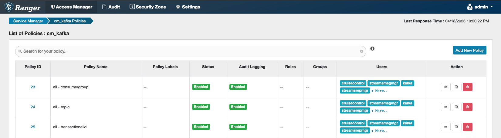

# Integration of CDE and Kafka

## upload config file

```bash
$ scp ./data/kafka-client.property cdpuser1@ccycloud-1.xhu-718.root.comops.site:~/
$ scp ./kafka/kafka-client-passwd.property cdpuser1@xhu-cm7101-1.xhu-cm7101.root.hwx.site:~/
```

## Test kafka on CDP Base

```bash
$ kinit -kt /cdep/keytabs/kafka.keytab -p kafka
```

list topics

```bash
$ JAVA_HOME=/usr/lib/jvm/java-openjdk-11 \
/opt/cloudera/parcels/CDH-7.1.8-1.cdh7.1.8.p0.30990532/lib/kafka/bin/kafka-topics.sh \
--command-config kafka-client.property \
--bootstrap-server ccycloud-1.xhu-718.root.comops.site:9093,ccycloud-3.xhu-718.root.comops.site:9093,ccycloud-2.xhu-718.root.comops.site:9093 \
--list

# use LDAP user/password as auth
$ JAVA_HOME=/usr/lib/jvm/java-openjdk-11 \
/opt/cloudera/parcels/CDH-7.1.7-1.cdh7.1.7.p2000.37147774/lib/kafka/bin/kafka-topics.sh \
--command-config kafka-client-passwd.property \
--bootstrap-server xhu-cm7101-1.xhu-cm7101.root.hwx.site:9093,xhu-cm7101-10.xhu-cm7101.root.hwx.site:9093,xhu-cm7101-2.xhu-cm7101.root.hwx.site:9093 \
--list
```

create a topic

```bash
$ JAVA_HOME=/usr/lib/jvm/java-openjdk-11 \
/opt/cloudera/parcels/CDH-7.1.8-1.cdh7.1.8.p0.30990532/lib/kafka/bin/kafka-topics.sh \
--command-config kafka-client.property \
--bootstrap-server ccycloud-1.xhu-718.root.comops.site:9093,ccycloud-3.xhu-718.root.comops.site:9093,ccycloud-2.xhu-718.root.comops.site:9093 \
--create \
--topic test

$ JAVA_HOME=/usr/lib/jvm/java-openjdk-11 \
/opt/cloudera/parcels/CDH-7.1.7-1.cdh7.1.7.p2000.37147774/lib/kafka/bin/kafka-topics.sh \
--command-config kafka-client-passwd.property \
--bootstrap-server xhu-cm7101-1.xhu-cm7101.root.hwx.site:9093,xhu-cm7101-10.xhu-cm7101.root.hwx.site:9093,xhu-cm7101-2.xhu-cm7101.root.hwx.site:9093 \
--create \
--topic test
```

Use delegation token

```bash
$ JAVA_HOME=/usr/lib/jvm/java-openjdk-11 \
/opt/cloudera/parcels/CDH-7.1.7-1.cdh7.1.7.p2000.37147774/lib/kafka/bin/kafka-delegation-tokens.sh \
--bootstrap-server xhu-cm7101-1.xhu-cm7101.root.hwx.site:9093,xhu-cm7101-10.xhu-cm7101.root.hwx.site:9093,xhu-cm7101-2.xhu-cm7101.root.hwx.site:9093 \
--create \
--max-life-time-period -1 \
--command-config kafka-client.property \
--renewer-principal User:cdpuser1
```

consume `test` topic

```bash
$ JAVA_HOME=/usr/lib/jvm/java-openjdk-11 \
/opt/cloudera/parcels/CDH-7.1.8-1.cdh7.1.8.p0.30990532/lib/kafka/bin/kafka-console-consumer.sh \
--consumer.config kafka-client.property \
--bootstrap-server ccycloud-1.xhu-718.root.comops.site:9093,ccycloud-3.xhu-718.root.comops.site:9093,ccycloud-2.xhu-718.root.comops.site:9093 \
--from-beginning \
--topic test
```

```bash
$ JAVA_HOME=/usr/lib/jvm/java-openjdk-11 \
/opt/cloudera/parcels/CDH-7.1.7-1.cdh7.1.7.p2000.37147774/lib/kafka/bin/kafka-console-consumer.sh \
--consumer.config kafka-client.property \
--bootstrap-server xhu-cm7101-1.xhu-cm7101.root.hwx.site:9093,xhu-cm7101-10.xhu-cm7101.root.hwx.site:9093,xhu-cm7101-2.xhu-cm7101.root.hwx.site:9093 \
--topic test
```

```bash
$ JAVA_HOME=/usr/lib/jvm/java-openjdk-11 \
/opt/cloudera/parcels/CDH-7.1.7-1.cdh7.1.7.p2000.37147774/lib/kafka/bin/kafka-console-consumer.sh \
--consumer.config kafka-client.property \
--bootstrap-server xhu-cm7101-1.xhu-cm7101.root.hwx.site:9093,xhu-cm7101-10.xhu-cm7101.root.hwx.site:9093,xhu-cm7101-2.xhu-cm7101.root.hwx.site:9093 \
--offset 23390550 \
--partition 0 \
--topic test
```

publish a message in the `test` topic

```bash
$ JAVA_HOME=/usr/lib/jvm/java-openjdk-11 \
/opt/cloudera/parcels/CDH-7.1.8-1.cdh7.1.8.p0.30990532/lib/kafka/bin/kafka-console-producer.sh \
--producer.config kafka-client.property \
--bootstrap-server ccycloud-1.xhu-718.root.comops.site:9093,ccycloud-3.xhu-718.root.comops.site:9093,ccycloud-2.xhu-718.root.comops.site:9093 \
--topic test
```

## Grant access to user

add permission for topics and consumer groups, transactionalid for cdpuser1 via Ranger


## Run Spark jobs against Kafka

make sure that all gateway hosts have authenticated using keytab

```bash
$ for i in {1..10} ; do scp /Users/xhu/Documents/Cloudera/ComputePlatform/cde-tools-xhu/realm-domains/root.hwx.site/cm7101/cdpuser1.keytab cdpuser1@xhu-cm7101-$i.xhu-cm7101.root.hwx.site:~/; done
$ for i in {1..10} ; do ssh cdpuser1@xhu-cm7101-$i.xhu-cm7101.root.hwx.site 'kdestroy'; done
$ for i in {1..10} ; do ssh cdpuser1@xhu-cm7101-$i.xhu-cm7101.root.hwx.site 'kinit -kt cdpuser1.keytab -p cdpuser1'; done
$ spark-submit --master yarn --deploy-mode cluster $HOME/hello-kafka-yarn.py
```

run spark in CDE using keytab and ticket cache, it will fail

```bash
$ spark-submit --master yarn --deploy-mode cluster $HOME/hello-kafka-cde.py
```

run spark in CDE using delegation token approach, it works on Spark-3.2

1. in spark-submit commandline, auth.bootstrap.servers need to be specified to enable delegation token
2. in Spark code, jaas.config needs to use `ScramLoginModule`
3. [delegation token](https://spark.apache.org/docs/3.2.0/structured-streaming-kafka-integration.html#security)
4. it does not work on Spark2.

```bash
$ spark-submit \
--master yarn \
--deploy-mode cluster \
--conf spark.kafka.clusters.base-cluster.auth.bootstrap.servers=ccycloud-1.xhu-718.root.comops.site:9093,ccycloud-3.xhu-718.root.comops.site:9093,ccycloud-2.xhu-718.root.comops.site:9093 \
$HOME/hello-kafka-cde-dt.py
```

```bash
$ spark-submit \
--master yarn \
--deploy-mode cluster \
--files=kafka-client-jaas-passwd.conf \
--conf spark.driver.extraJavaOptions=-Djava.security.auth.login.config=./kafka-client-jaas-passwd.conf \
--conf spark.executor.extraJavaOptions=-Djava.security.auth.login.config=./kafka-client-jaas-passwd.conf \
$HOME/hello-kafka-cde-dt.py
```

```bash
$ spark-submit \
--master yarn \
--deploy-mode cluster \
--conf spark.kafka.bootstrap.servers=xhu-cm7101-1.xhu-cm7101.root.hwx.site:9093,xhu-cm7101-10.xhu-cm7101.root.hwx.site:9093,xhu-cm7101-2.xhu-cm7101.root.hwx.site:9093 \
$HOME/hello-kafka-cde-dt-stream-spark2.py
```

# run a spark job in CDE using LDAP auth

```bash
$ spark-submit --master yarn --deploy-mode cluster $HOME/hello-kafka-cde-dt-basic-auth.py
```

```bash
spark3-submit --master yarn --deploy-mode client --conf \
spark.kerberos.principal=cm_user@COMPING.HR \
spark.kerberos.keytab=cm_user.keytab \
spark.kerberos.access.hadoopFileSystems=hdfs://mgr.cdp.comping.hr:8020 \
spark.files=jaas.conf,cm_user2.keytab \
spark.jars.packages=org.apache.kudu:kudu-spark3_2.12:1.15.0,org.apache.spark:spark-sql-kafka-0-10_2.12:3.2.1 \
spark.driver.extraJavaOptions=-Djava.security.auth.login.config=./jaas.conf \
spark.executor.extraJavaOptions=-Djava.security.auth.login.config=./jaas.conf
```

```bash
spark-submit \
--master yarn \
--deploy-mode cluster \
--queue streaming \
--name realtime_Fraud_Negative_Email \
--executor-cores 3 \
--num-executors 2 \
--executor-memory 15G \
--driver-memory 10G \
--files /home/hadoopdevuser01/BDL_USECASES/Fraud_Beneficiary_Rules/streaming/files/config/jaas.conf#jaas.conf,/home/hadoopdevuser01/BDL_USECASES/Fraud_Beneficiary_Rules/streaming/files/config/server.truststore.jks#server.truststore.jks,/home/hadoopdevuser01/BDL_USECASES/Fraud_Beneficiary_Rules/streaming/files/config/ca_certificate#ca_certificate \
--principal "hadoopdevuser01@AXISB.COM"  \
--keytab /home/hadoopdevuser01/hadoopdevuser01.keytab \
--conf "spark.sql.streaming.minBatchesToRetain=100" \
--conf "spark.sql.streaming.checkpointLocation=/user/hadoopdevuser01/BDL_Usecases/Fraud_Beneficiary_Rules/streaming/checkpoint_test/Negative_Email" \
--conf "spark.executor.extraJavaOptions=-Djava.security.auth.login.config=./jaas.conf" \
--conf "spark.driver.extraJavaOptions=-Djava.security.auth.login.config=./jaas.conf" \
--conf "spark.kafka.ssl.truststore.location=./server.truststore.jks" \
--conf "spark.kafka.ssl_cafile=./ca_certificate" \
--conf "spark.kafka.ssl.truststore.password=XXXXX" \
--conf "spark.kafka.security.protocol=SASL_SSL" \
--jars /home/hadoopdevuser01/BDL_USECASES/Fraud_Beneficiary_Rules/streaming/files/jars/spark-streaming-kafka-0-10_2.11-2.4.7.7.1.7.0-551.jar,/home/hadoopdevuser01/BDL_USECASES/Fraud_Beneficiary_Rules/streaming/files/jars/spark-sql-kafka-0-10_2.11-2.4.7.7.1.7.0-551.jar \
/home/hadoopdevuser01/BDL_USECASES/Fraud_Beneficiary_Rules/streaming/code/pyspark/negative_email.py &> /home/hadoopdevuser01/BDL_USECASES/Fraud_Beneficiary_Rules/streaming/logs/negative_email.log
```

```bash
spark-submit \
--master yarn \
--deploy-mode cluster \
--keytab ./hive-user.keytab \
--principal hive@ROOT.HWX.SITE \
--conf spark.executor.extraJavaOptions="-Djava.security.auth.login.config=kafka_client_jaas.conf" \
--conf spark.driver.extraJavaOptions="-Djava.security.auth.login.config=kafka_client_jaas.conf" \
--files ./cm-auto-global_truststore.jks,./kafka_client_jaas.conf,./hive.keytab  \
--jars ./kafka-clients-2.5.0.7.1.7.1000-141.jar,./spark-sql-kafka-0-10_2.11-2.4.7.7.1.7.1000-141.jar \
--conf spark.sql.shuffle.partitions=12  \
--class com.cloudera.cde.spark.SparkStreamingDemo \
/tmp/pankaj/hellospark_2.11-0.1.0-SNAPSHOT.jar
```
